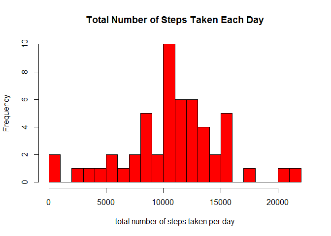
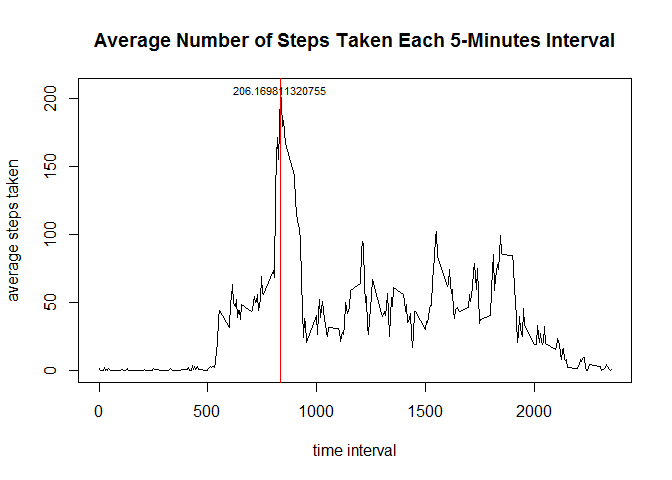
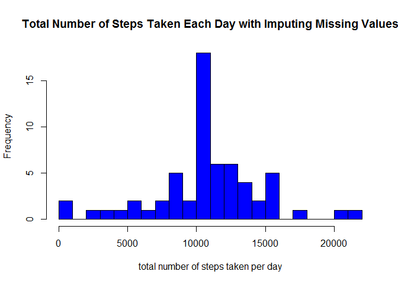

# Reproducible Research: Peer Assessment 1


## Introduction

It is now possible to collect a large amount of data about personal movement using activity monitoring devices such as a Fitbit, Nike Fuelband, or Jawbone Up. These type of devices are part of the "quantified self" movement - a group of enthusiasts who take measurements about themselves regularly to improve their health, to find patterns in their behavior, or because they are tech geeks. But these data remain under-utilized both because the raw data are hard to obtain and there is a lack of statistical methods and software for processing and interpreting the data.

This assignment makes use of data from a personal activity monitoring device. This device collects data at 5 minute intervals through out the day. The data consists of two months of data from an anonymous individual collected during the months of October and November, 2012 and include the number of steps taken in 5 minute intervals each day.

## Data

The data for this assignment can be downloaded from the course web site: [Activity monitoring data](https://d396qusza40orc.cloudfront.net/repdata%2Fdata%2Factivity.zip) [52K]

The variables included in this dataset are:

- steps: Number of steps taking in a 5-minute interval (missing values are coded as NA)
- date: The date on which the measurement was taken in YYYY-MM-DD format
- interval: Identifier for the 5-minute interval in which measurement was taken

The dataset is stored in a comma-separated-value (CSV) file and there are a total of 17,568 observations in this dataset.

## Loading and preprocessing the data

```r
# Read the data from file
setwd("./")  
activity.data <- read.csv(unz("activity.zip", "activity.csv"), stringsAsFactors = F)

# Process/transform the data (if necessary) into a format suitable for your analysis
activity.data$date <- as.Date(activity.data$date, "%Y-%m-%d")
# Check out the dataset and its structure
head(activity.data)
```

```
##   steps       date interval
## 1    NA 2012-10-01        0
## 2    NA 2012-10-01        5
## 3    NA 2012-10-01       10
## 4    NA 2012-10-01       15
## 5    NA 2012-10-01       20
## 6    NA 2012-10-01       25
```

```r
str(activity.data)
```

```
## 'data.frame':	17568 obs. of  3 variables:
##  $ steps   : int  NA NA NA NA NA NA NA NA NA NA ...
##  $ date    : Date, format: "2012-10-01" "2012-10-01" ...
##  $ interval: int  0 5 10 15 20 25 30 35 40 45 ...
```

## What is mean total number of steps taken per day?

```r
# Organize the date by days, ignoring the missing values
# Calculate and report the mean and median total number of steps taken per day
sum.steps.per.day <- aggregate(steps ~ date, data = activity.data, sum)
mean.steps = as.integer(mean(sum.steps.per.day$step, na.rm = T))
median.steps = as.integer(median(sum.steps.per.day$step, na.rm = T))
```
- The mean total number of steps taken per day is 10766.00.  
- The median total number of steps taken per day is 10765.00.


```r
# Plot histogram of the total number of steps taken each day
hist(sum.steps.per.day$steps, 
     main="Total Number of Steps Taken Each Day",
     breaks = 20,
     col = "red",
     xlab = "total number of steps taken per day"
     ) 
```

 

## What is the average daily activity pattern?

```r
# Organize the data by daily time series
daily.steps <- aggregate(steps ~ interval, data = activity.data, mean)
# Make a time series plot (i.e. type = "l") of the 5-minute interval (x-axis) 
# and the average number of steps taken, averaged across all days (y-axis)
plot(daily.steps$interval, 
     daily.steps$steps,
     type = "l",
     main = "Average Number of Steps Taken Each 5-Minutes Interval",
     xlab = "time interval",
     ylab = "average steps taken")

abline(v = daily.steps[daily.steps$steps == max(daily.steps$steps), 1], 
       col = "red")
text(x = daily.steps[daily.steps$steps == max(daily.steps$steps),1],
     y = max(daily.steps$steps),
     labels= max(daily.steps$steps),
     cex= 0.7, offset = 10)
```

 

Which 5-minute interval (on average across all the days in the dataset) contains the maximum number of steps?

```r
maximun.activity.pattern  = daily.steps[daily.steps$steps == max(daily.steps$steps),1]
print(maximun.activity.pattern)
```

```
## [1] 835
```
The 835th 5-minute interval contains the maximum number of steps.

## Imputing missing values


```r
# Calculate and report the total number of missing values in the dataset
# (i.e. the total number of rows with NAs)
num.missing.values = sum(is.na(activity.data$steps))
print(num.missing.values)
```

```
## [1] 2304
```
The total number of missing values in the dataset is 2304.
We noted that there are 2304 intervals where there are missing values (coded as NA). The presence of missing days may introduce bias into some calculations or summaries of the data.

When imputing the missing values, the strategy selected to fill-in all of the missing values in the dataset is to replace with the mean for that 5-minute interval.

```r
# Create a new dataset that is equal to the original dataset but with the missing data filled-in
new.activity.data <- activity.data
for (i in 1:length(new.activity.data$steps)) {
       if (is.na(new.activity.data$steps[i])) {
               mean.activity <- daily.steps[daily.steps$interval == new.activity.data$interval[i], 2]
               new.activity.data$steps[i] <- mean.activity }        
}

# After imputing missing values, re-calculate and report the new mean and 
# median total number of steps taken per day
new.sum.steps.per.day <- aggregate(steps ~ date, data = new.activity.data, sum)
new.mean.steps = as.integer(mean(new.sum.steps.per.day$step, na.rm = T))
new.median.steps = as.integer(median(new.sum.steps.per.day$step, na.rm = T))
print(new.mean.steps)
```

```
## [1] 10766
```

```r
print(new.median.steps)
```

```
## [1] 10766
```

```r
# Plot the histogram of the total number of steps taken each day
hist(new.sum.steps.per.day$steps, 
     main="Total Number of Steps Taken Each Day with Imputing Missing Values",
     col = "blue",
     breaks = 20,
     xlab = "total number of steps taken per day"
     ) 
```

 

After replacing 2304.0 missing values with mean value of that 
interval,

- the mean total number of steps taken per day was 10766.00
- the median total number of steps taken per day was 10766.00 

### What is the impact of imputing missing data on the estimates of the total daily number of steps?

- By comparing with the calculations done in the first section of this document, it is observed that the mean value remains unchanged while the median value has increased by a little. 
- Comparison of the two histograms also shows that there is virtually no / little change in distribution of data values.

It seems the impact of imputing missing data has increased the median value by a small amount by should not have any other impact.

## Are there differences in activity patterns between weekdays and weekends?
For this part the weekdays() function and the dataset with the filled-in missing values is used. The appraoch is to split the data by week.label and time interval, then calculate the mean steps for each combine of weeklabel and time interval, using lattice to give a plot to visually show the answer.


```r
# Using the dataset with the filled-in missing values, create a new factor 
# variable in the dataset with two levels - "weekday" and "weekend" indicating 
# whether a given date is a weekday or weekend day.
weekdays = c("Monday", "Tuesday", "Wednesday", "Thursday", "Friday")
weekends = c("Saturday", "Sunday")

# add week labels to the dataset
week.label = vector()
new.activity.data$date <- weekdays(new.activity.data$date)
for (i in 1:length(new.activity.data$date)){
        if (new.activity.data$date[i] %in% weekdays){
                week.label = c(week.label, "weekday")  }
        else{
                week.label = c(week.label, "weekend")  }
}
new.activity.data <- transform( new.activity.data, week.labels = week.label)

# split the data by week label and interval then calcualte the mean steps, and plot
mean.steps.per.interval <- aggregate(steps ~ interval + week.labels, 
                                     data = new.activity.data, mean)
library(lattice)
xyplot(steps ~ interval|week.labels, 
       data = mean.steps.per.interval,
       type = "l",
       xlab = "Interval",
       ylab = "Number of steps",
       layout=c(1,2))
```

 

- It is observed that people are more active on weekends. This may be because they have more available free time to engage in exercise activities on weekends.
- It is observed that the highest activity peak (> 200 steps) is found during weekdays. 
- However, there are more number of activity peaks ( > 100 steps) during weekends as compared with the weekdays. This may be weekday activities are work-related and not very intensive while people usually engage in sports activities on weekends.
